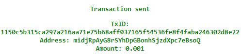
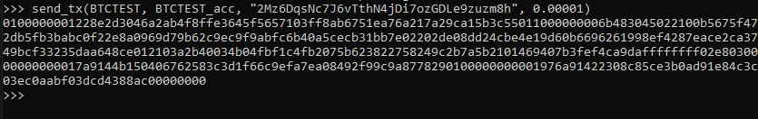
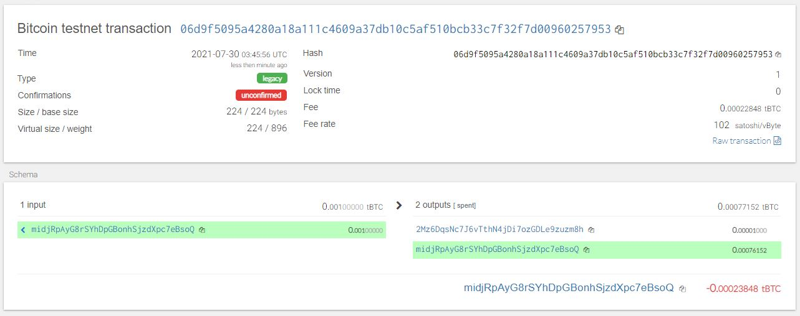
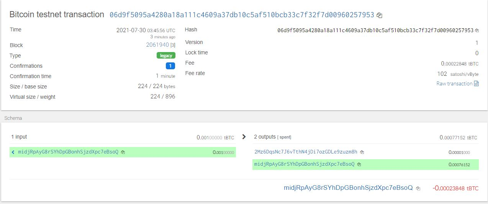
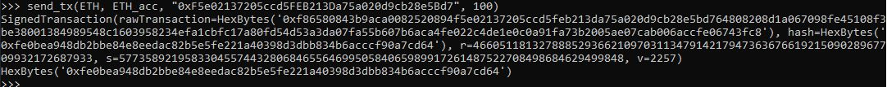
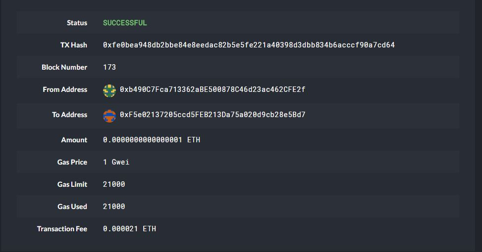

# Wallet

## Setup
In a new environment, run the following code:  `pip install -r requirements.txt`

Install the HD Wallet Derive tool by following the following instructions after installing PHP version 7.3:

- Type `C:\Program Files\Git\bin\bash.exe` in the windows search bar and right click to run as administrator
- cd into your wallet directory and run the code below

    >`git clone https://github.com/dan-da/hd-wallet-derive`  
    >`cd hd-wallet-derive`  
    >`curl https://getcomposer.org/installer -o installer.php`  
    >`php installer.php`  
    >`php composer.phar install`  

## Usage

### Functions of wallet.py 
- Derive wallet keys from a created mneumonic 
- Convert private key strings to account objects that can be used for transactions
- Send Transactions on the blockchain

## Test Transactions

---
#### BTCTEST
- Prefunding the btctest account

- python code to send transaction in terminal

-confirmation of successful transaction

---
#### ETH
- python code to send transaction in terminal

-confirmation of successful transaction
